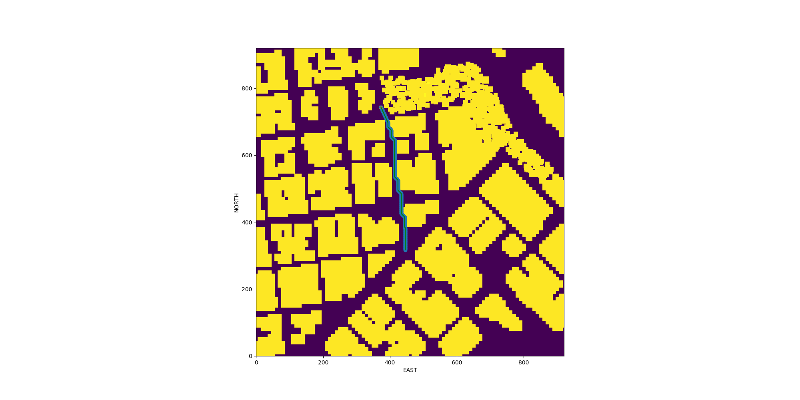
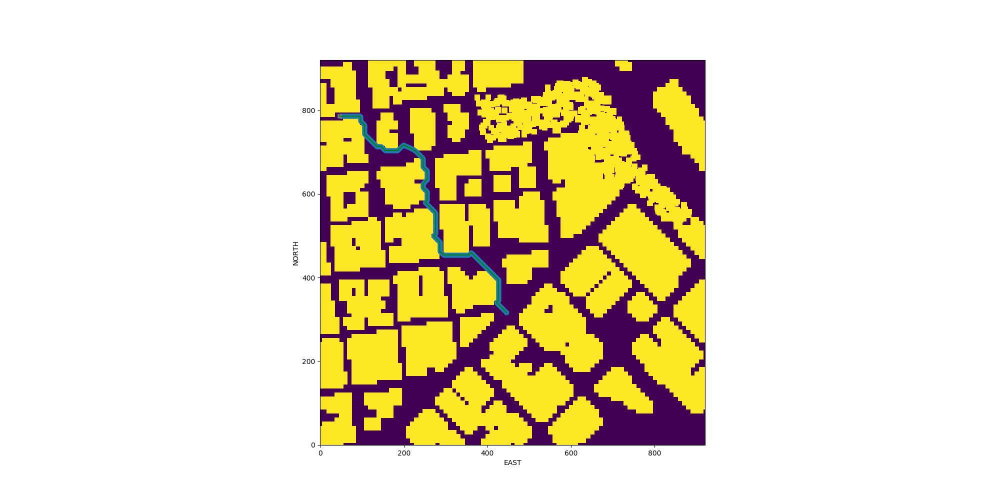
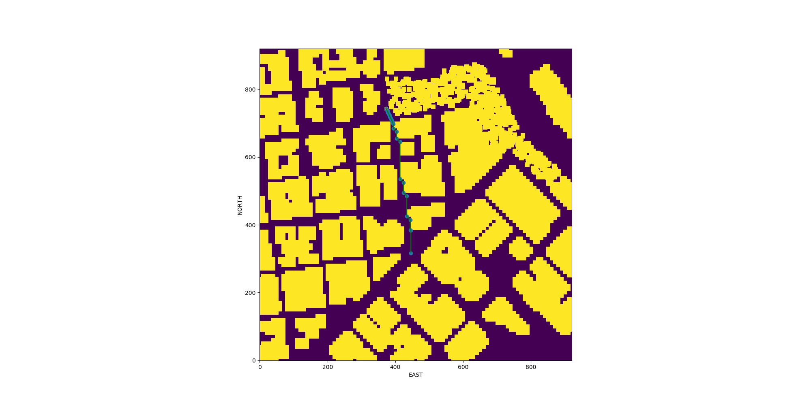
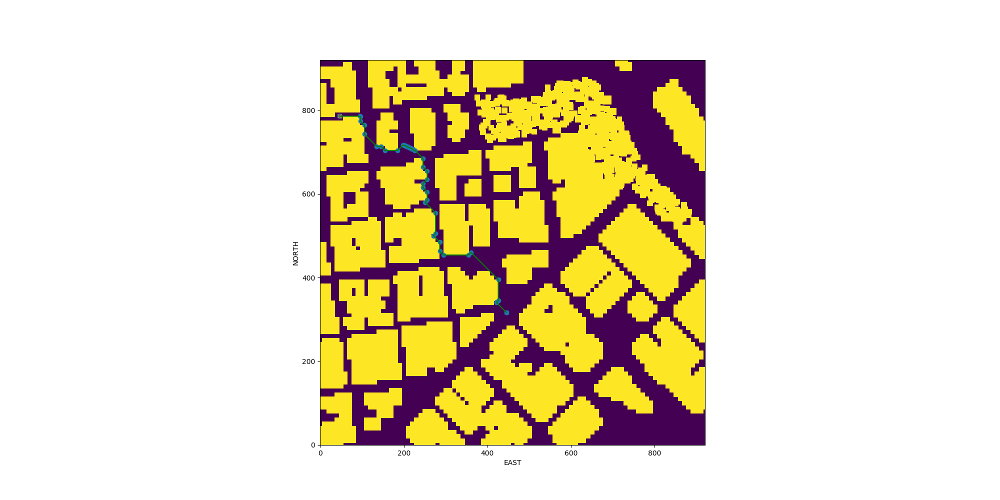
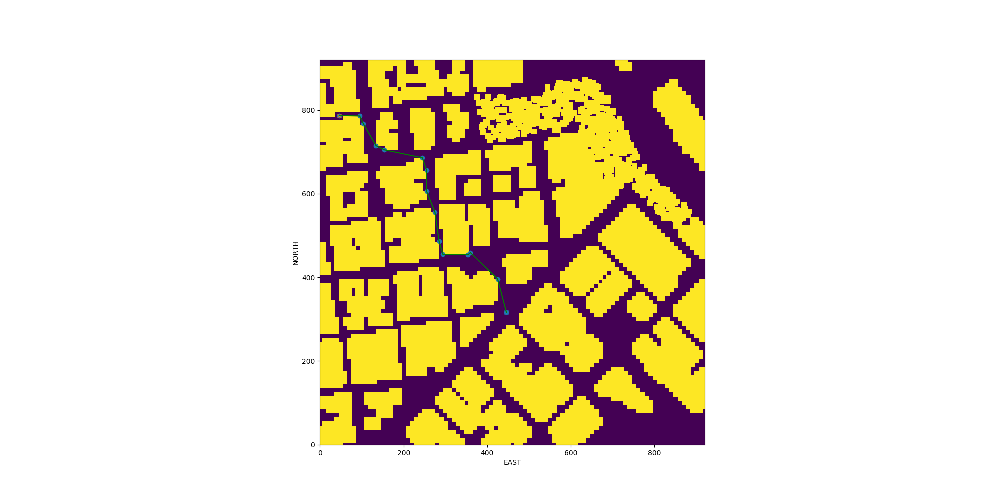

# Writeup

## Explaining the starter code

The `motion_planning_starter.py` and  `planning_utils_starter.py` implements a simple but complete planning system. 

Running the code files the quad from a start location (set to map center) to a goal 10 meters away.

The code has an additional `PLANNING` state. When the quad is armed, it goes into the `PLANNING` state. It stays in this state until planning is complete. The planning is done in `plan_path()`, which has the following steps:
1. Read the file `colliders.csv` for obstacle data
2. Create a grid representation from the obstacle data in `create_grid()` method of `planning-utils_starter.py`
3. Define the start point at the middle of the map and goal point is selected to be 10 m away
4. Find a path using  A* search implemented in `a_star()` method of `planning-utils_starter.py`
5. Convert the path into waypoints and send the waypoints to simulator

## Path Planning implementation

### Setting global home position

The starter code sets the home position to the drone's initial location. The task is to read the global home location from the first line of the `colliders.csv` file and set that position as global home.

The code at [line 130-134](https://github.com/arrawatia/FCND-Motion-Planning/blob/master/motion_planning.py#L130-L134) reads the `lat0` and `lon0` from the first line of `colliders.csv`.

The code at [line 137 ](https://github.com/arrawatia/FCND-Motion-Planning/blob/master/motion_planning.py#L137) uses the `self.set_home_position()` function to set the home location.

### Get current local position from global position
The task is to retrieve the drone's current position in geodetic coordinates and then convert them to local position.

The code at [line 143](https://github.com/arrawatia/FCND-Motion-Planning/blob/master/motion_planning.py#L143) takes the current global position in geodetic coordinates and converts them to local ECEF NED coordinates.

### Set grid start position to local position
The starter code sets the drone take-off position to the map center. We need to set it to any location. The task is to set it to the current local position.

The code at [line 156-158](https://github.com/arrawatia/FCND-Motion-Planning/blob/master/motion_planning.py#L156-L158) sets the start location to the current location on the grid.

### Set grid goal position to any geodetic coords from the CLI
The starter code sets the goal position to a location 10 m north and 10 m east of map center. The task is to make it flexible to set the goal location to any point passed in from the CLI.

The code at [line 230-232](https://github.com/arrawatia/FCND-Motion-Planning/blob/master/motion_planning.py#L230-L232) and [line 40](https://github.com/arrawatia/FCND-Motion-Planning/blob/master/motion_planning.py#L40) shows how to modify the drone class to accept goal location in geodetic coordinates.

The code at [line 163-166](https://github.com/arrawatia/FCND-Motion-Planning/blob/master/motion_planning.py#L163-L166) shows how to set the goal location in local coordinates.


### Modify A* to include diagonal motion

The starter code implements A* with 4 actions: **EAST, WEST, NORTH, SOUTH** each with **cost = 1**. 

The goal is to add diagonal actions with **SOUTH_EAST, NORTH_EAST, SOUTH_WEST, NORTH_WEST** each with **cost = `sqrt(2)`**

The code at [line 58-61](https://github.com/arrawatia/FCND-Motion-Planning/blob/master/planning_utils.py#L58-L61) and [line 91-98](https://github.com/arrawatia/FCND-Motion-Planning/blob/master/planning_utils.py#L91-L98) adds the additional actions to the A* algorithm.

The following graphs show the path for 2 test runs.



### Cull waypoints

The task is to prune the waypoints using Collinearity and Bresenham. 

The code at [line 170-192](https://github.com/arrawatia/FCND-Motion-Planning/blob/master/planning_utils.py#L170-L192) implements path pruning using the **Collinearity method**.

The code at [line 215-237](https://github.com/arrawatia/FCND-Motion-Planning/blob/master/planning_utils.py#L215-L237) implements path pruning using **Bresenham's algorithm**.

Bresenham's algorithm gives much more smoother paths than the Collinearity method as shown in the figures below.

#### Experiment 1


#### Experiment 2
 

## Executing the flight

I ran 2 experiments and set the goal location to random positions on the map. 

This gif shows the recorded flight (at much higher speed) from the second experiment.


A higher resolution video of the same experiment with normal speed is here. [2-480p.mov](2-480p.mov)

**Note** : The planning step took very long on my computer which caused the connection between the `udacidrone` code and simulator to time out. After a lot of debugging, I added caching to the code. The code saves the plan to a file. You can run it again with the same `--run_id` argument to use it to simulate the flight if you see timeouts.


# How to run the code ?

1. Activate the conda enviornment

        conda activate fcnd

2. Run the simulator and select the path planning scenario.

3. Run the experiments

    Experiment 1
    ```
    python motion_planning.py \
        --desired_goal_lon -122.398248 \
        --desired_goal_lat 37.796342 \
        --desired_goal_alt 5 \
        --run_id 1
    ```
    
    Experiment 2
    ```
    python motion_planning.py \
        --desired_goal_lon -122.40195876 \
        --desired_goal_lat 37.79673913 \
        --desired_goal_alt -0.147 \
        --run_id 2
    ```

    **If you see timeout errors, see the NOTE above.**